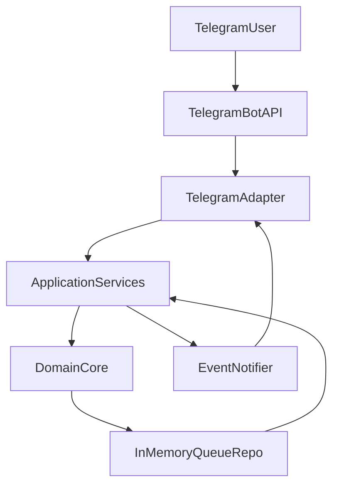

# Архитектура бота очереди (DDD)

## Слои
- **domain** — сущности (`Match`, `QueueState`), доменный сервис `QueueService`, инварианты расписания и поиска соперников.
- **application** — use-case хэндлеры (`RegisterSearch`, `AddMatch`, `CancelSearch`, `CancelMatch`, `GetQueue`, `GetPlayed`) и сервис оркестрации матчей `MatchOrchestrator`.
- **infrastructure** — реализации портов: `InMemoryQueueRepository`, `EventNotifier` (EventEmitter), `NodeTimer`, `SystemClock`.
- **interfaces/telegram** — адаптер Telegram API, маппинг команд/кнопок на use-case.

## Потоки
- Инициализация: при старте бота создается контекст чата из `TG_CHAT_ID`, подписка на `EventNotifier` и установка команд.
- Inline query:
  - `Найти игрока` → `RegisterSearch` добавляет игрока в поиск и формирует текст.
  - `Проверить очередь` → `GetQueue`.
  - `Посмотреть тех, кто уже отыграл` → `GetPlayed`.
- Callback:
  - `i_want_to_play_with_` → `AddMatch` (валидирует игрока в поиске, создаёт матч, запускает таймеры через `MatchOrchestrator`).
  - `i_want_to_cansel` → `CancelSearch` (только автор).
  - `i_want_to_out` → `CancelMatch` (только участник матча), переназначает таймеры для следующей пары.

## Таймеры и события
- `MatchOrchestrator` ставит таймер старта/окончания через `NodeTimer`, публикует сообщения через `EventNotifier`.
- При завершении матча вызывается `QueueService.finishCurrent`, переводя очередь и запускаю следующий матч (если есть).

## Форматы сообщений
- Все тексты централизованы в `src/application/messages/templates.js`.
- Временные метки форматируются через `TIME_OPTIONS` (`src/application/config/time.js`).

## Тестирование
- Jest (`npm test`): покрытие доменного сервиса `QueueService` и use-case `AddMatch`.
- Дополнительные тесты можно добавлять в `src/__tests__/` (используются реальные реализации без Telegram API).

## Identity state и rollout
- QueueState v2 владеет identity mirror через тот же Redis CAS: claim проходит
  `pending → persist player generation → active`; старые поколения сохраняются
  как tombstones и не переиспользуются.
- До запуска HTTP, polling и timer recovery выполняется idempotent migration.
  Legacy queue/search/played/matches очищаются, поскольку их participant identity
  нельзя доказать; epoch поднимается выше известных player generations.
- Rollout должен быть coordinated: сначала остановить всех bot/backend writers,
  затем развернуть v2 на всех экземплярах и только после этого запускать migration.
  Нельзя откатывать v2 Redis state на старые бинарии.
